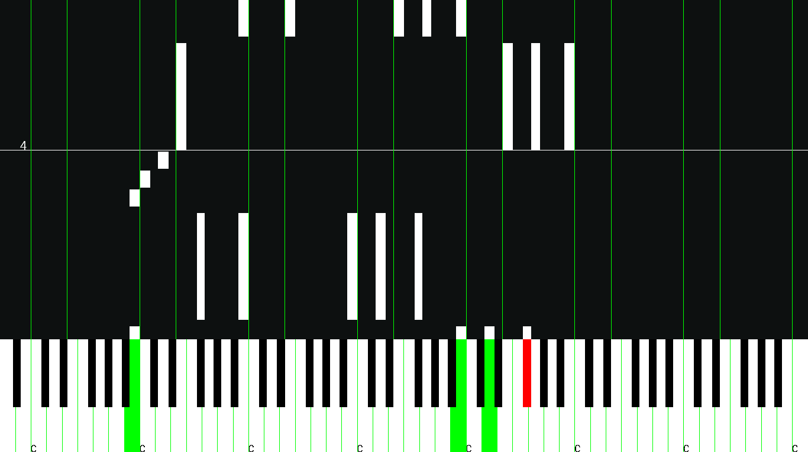
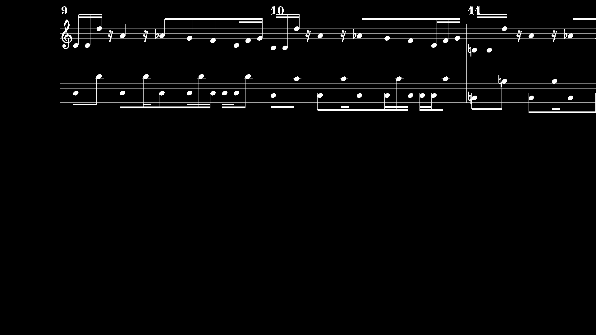
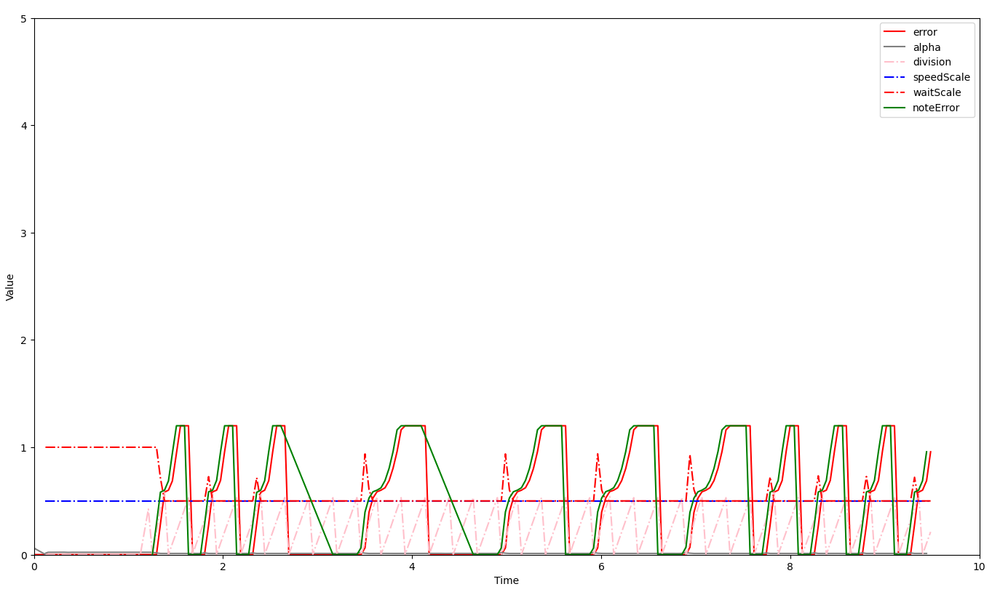
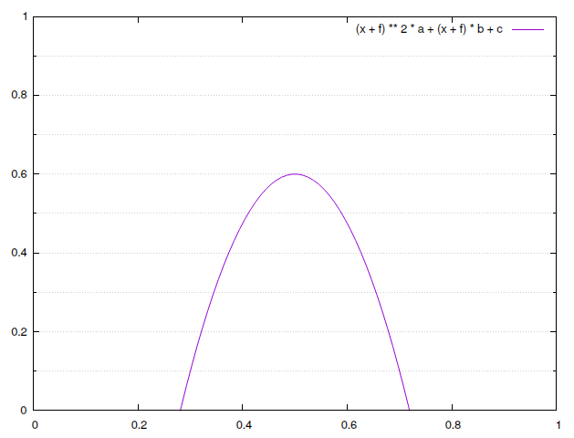

# PianoTutor
> This is still an alpha version, which does not yet have implemented all the minimal functionality, (i am working on it :3).

PianoTutor is meant to be a tool, which will help you to learn faster and better songs that you love.
Also meant to be FOSS tool/app as a replacement to a lot of paied options that probably already exists.
Program accepts MusicXML files. For more info run the program with `--help` flag.

## Images



#### Old Images


### build
```bash
make init
make
```

### debuggin
- `make debug` will automaticly run the code with `gdb`

- `make plot` will plot values in real time using python and matplotlib


- `make gnuplot` will show the note error equation in gnuplot



## dependencies
- glew (opengl)
- glfw3
- cglm
- libxml2
- libzip

```
yay -S cglm glew libzip
```

## Software
- Blender

```
sudo apt install libglew-dev libglfw3-dev
sudo apt install mesa-common-dev
sudo apt install mesa-utils
```
