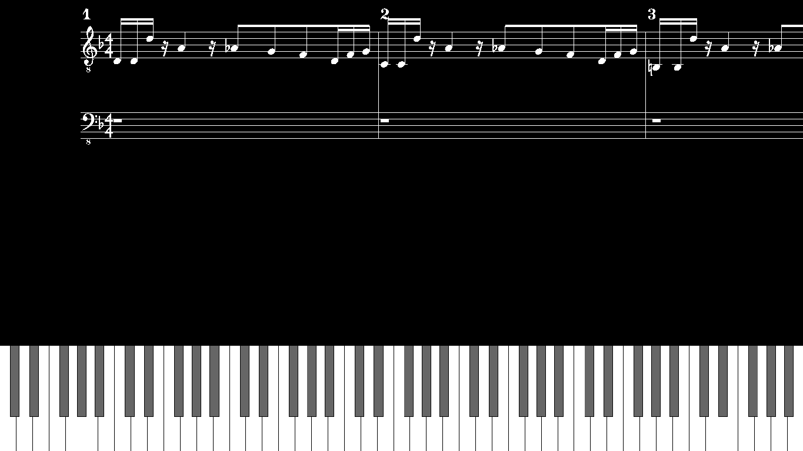

# PianoTutor
PianoTutor is meant to be a tool, which will help you to learn faster and better songs that you love.
This is also meant to be FOSS tool/app as a replacement to a lot of paied options that already exists.

## Images



#### Old Images


### build
```bash
make init
make
```

## Dependencies
- glew (opengl)
- glfw3
- cglm
- libxml2
- libzip

## Software
- Blender

```
sudo apt install libglew-dev libglfw3-dev
sudo apt install mesa-common-dev
sudo apt install mesa-utils
```
